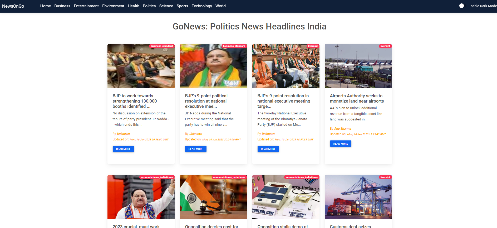

# Introduction
This is a React-based news portal that utilizes functional components to keep users informed of current events. The app utilizes the newsdata.io API to fetch news articles and display them on the web application. The app is designed to be user-friendly and easy to navigate, making it a convenient tool for anyone who wants to stay informed about the latest news. Users can browse through a variety of categories, such as politics, sports, entertainment, and more, to find the news that interests them. The app also allows users to search for specific news articles. Overall, this app is a useful tool for anyone who wants to stay informed about the latest news and current events.

## Packeges Used:
   

## Website Screenshot:

## You can check the demo at:  https://newsongo.netlify.app/

## Getting Started with Create React App

This project was bootstrapped with [Create React App](https://github.com/facebook/create-react-app).

## In the project directory, you can run:
### `npm install`

### `npm start`
Runs the app in the development mode.
Open [http://localhost:3000](http://localhost:3000) to view it in your browser.

The page will reload when you make changes.\
You may also see any lint errors in the console.

### `npm run build`

Builds the app for production to the `build` folder.\
It correctly bundles React in production mode and optimizes the build for the best performance.

Your app is ready to be deployed!
